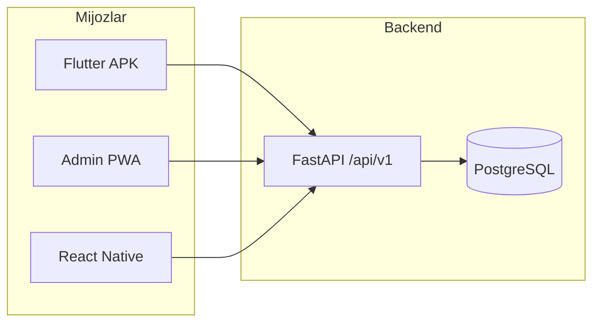

# WMS loyihasi — to‘liq texnik hisobot

Bu hujjat **FB Warehouse / WMS** (Warehouse Management System) monorepo loyihasining tuzilishi, texnologiyalari, asosiy modullari va joylashtirish haqida umumiy ma’lumot beradi. Maqsad — yangi ishlab chiquvchi yoki administrator loyihani tezda tushunishi uchun qisqa, lekin qamrovli ko‘rinish.

---

## 1. Loyihaning maqsadi va qamrovi

**WMS** ombor operatsiyalarini boshqarish uchun mo‘ljallangan:

- mahsulotlar, lokatsiyalar, qoldiqlar (stock lots, movements);
- kirim (receiving), chiqim va yig‘ish (picking), inventarizatsiya va tuzatishlar;
- buyurtmalar va hujjatlar (picking hujjatlari, controller oqimi);
- **mijozdan qaytarish** (customer returns): controller tekshiruvi, yig‘uvchiga biriktirish, omborga joylashtirish;
- admin panel orqali monitoring, hisobotlar, integratsiyalar (masalan Smartup);
- mobil ilovalar orqali yig‘uvchi, controller va boshqa rollar uchun maydonda ishlash.

Loyiha **bir backend API** atrofida birlashtirilgan bir nechta mijoz (web admin PWA, Flutter APK, React Native `mobile` papkasi) arxitekturasiga ega.

---

## 2. Repositoriy tuzilishi (yuqori daraja)

| Papka / komponent | Vazifasi |
|-------------------|----------|
| `backend/` | FastAPI REST API, PostgreSQL, Alembic migratsiyalar, audit, integratsiyalar |
| `mobile_flutter/` | Asosiy mobil ilova (Flutter 3.x): yig‘ish, kirim, qaytarish, skaner |
| `mobile-pwa/` | Admin va boshqaruv uchun React + Vite PWA (brauzer / Tauri / mobil shell) |
| `mobile/` | React Native kod bazasi (API bilan mos `env.ts` / API URL qoidalari) |
| Root `requirements.txt` | Ba’zi umumiy Python bog‘liqliklari (asosiy backend `backend/requirements.txt` da) |

---

## 3. Backend (`backend/`)

### 3.1 Texnologiyalar

- **FastAPI** — REST API, `/docs` va `/redoc` orqali hujjatlashtirish.
- **SQLAlchemy** — ORM.
- **Alembic** — ma’lumotlar bazasi migratsiyalari (`backend/alembic/versions/`).
- **PostgreSQL** — asosiy DB (production uchun `psycopg2-binary`).
- **Autentifikatsiya** — JWT (`python-jose`), parollar (`passlib`).
- **Firebase Admin** — push / boshqa Firebase vazifalari uchun.
- **Locust** — yuk sinovi (`backend/locustfile.py`).

### 3.2 API modullari (prefixlar)

Asosiy router (`app/api/v1/router.py`) quyidagi yo‘nalishlarni birlashtiradi (to‘liq emas, eng ko‘zga tashlanadiganlari):

| Prefix | Mazmun |
|--------|--------|
| `/auth` | Kirish, token |
| `/users` | Foydalanuvchilar |
| `/products`, `/brands` | Mahsulotlar va brendlar |
| `/locations` | Ombor lokatsiyalari |
| `/inventory` | Zaxira, xarita, inventarizatsiya |
| `/receiving` | Kirim hujjatlari |
| `/customer-returns` | Mijoz qaytarishlari |
| `/documents`, `/picking`, `/orders` | Buyurtma va yig‘ish hujjatlari |
| `/movements`, `/movements-orikzor` | Harakatlar |
| `/dashboard` | Dashboard statistikasi |
| `/reports` | Hisobotlar |
| `/notifications` | Bildirishnomalar (API) |
| `/scanner` | Skaner yechimlari bilan bog‘liq endpointlar |
| `/integrations`, `/waves` | Integratsiya va to‘lqinlar |
| `/audit` | Audit jurnali |
| `/general-customers`, `/vip-customers` | Mijozlar modullari |
| `/download` | Yuklash |

**Eslatma:** Haqiqiy endpointlar va sxemalar uchun ishlab chiqarishda `/docs` dan foydalanish tavsiya etiladi.

### 3.3 CORS va muhit

`app/main.py` ichida CORS `CORS_ORIGINS` muhit o‘zgaruvchisi yoki standart ro‘yxat (masalan Vercel domenlari, `fbwarehouse.uz`, Tauri `localhost`, `vercel.app` regex) bilan sozlanadi. Deployda originlar aniq berilishi kerak.

### 3.4 Joylashtirish (backend)

Backend **VPS server**da host qilinadi. Production API: **`https://api.fbwarehouse.uz`**. PostgreSQL va SmartUp worker (`wms-smartup-worker`) ham shu serverda. Deploy va yangilash: [`backend/deploy/vps/VPS_DEPLOY_RUNBOOK.md`](backend/deploy/vps/VPS_DEPLOY_RUNBOOK.md), `bash deploy/vps/update-wms.sh`. Mahalliy rivojlantirish: `localhost:8000`.

---

## 4. Ma’lumotlar modeli (umumiy)

Backendda jadval va modellar orqali ifodalangan asosiy tushunchalar:

- **Mahsulotlar** — SKU, shtrix kodlar, brendlar.
- **Lokatsiyalar** — joy kodlari, zonalar.
- **Stock lots va movements** — partiya, muddat, miqdor o‘zgarishi; harakat turi (`receipt`, `pick`, `adjust`, va hokazo).
- **Hujjatlar / buyurtmalar** — yig‘ish jarayoni bilan bog‘liq `documents` va buyurtma holatlari.
- **Customer returns** — `customer_returns` va `customer_return_lines`; holatlar zanjari: controller tasdig‘i, yig‘uvchiga biriktirish, yakunlashda zaxiraga `stock_movements` yozish.
- **Audit** — muhim amallar jurnali.

Migratsiyalar `alembic` bilan versiyalanadi; yangi deployda **`alembic upgrade head`** talab qilinadi.

---

## 5. Admin panel — `mobile-pwa/`

### 5.1 Texnologiyalar

- **React**, **TypeScript**, **Vite**
- **react-router-dom**, **react-i18next**
- UI: **Tailwind** uslubidagi komponentlar, Radix tooltip va boshqalar
- **Capacitor / Tauri** skriptlari — mobil/desktop qadoqlash uchun (`package.json` ichida)

### 5.2 Funksional bo‘limlar (namuna)

Admin marshrutlari `src/pages/admin/` ostida jamlangan. Masalan:

- **Dashboard**, **Orders**, **Pick lists**
- **Mahsulotlar** — ro‘yxat, tafsilot, kirim tarixi, zaxira salomatligi
- **Lokatsiyalar**, **Inventarizatsiya**, **Harakatlar**, **Kamomatlar**
- **Kirim (Receiving)** — hujjatlar ro‘yxati va tafsilot
- **Qaytimlar tarixi** (`ReturnsHistoryPage`) — mijoz qaytarish hujjatlari
- **Foydalanuvchilar**, **Audit**, **Integratsiyalar (Smartup)**, **VIP / umumiy mijozlar**
- **Brendlar**, **Hisobotlar**, **profil**

Ruxsatlar `admin:access` va modulga xos permissionlar (masalan `receiving:read`, `products:read`) bilan cheklangan.

---

## 6. Flutter mobil ilova — `mobile_flutter/`

### 6.1 Texnologiyalar

- **Flutter** (SDK `^3.5.0`)
- **Riverpod** — holat boshqaruvi
- **go_router** — marshrutlash va login redirect
- **dio** — HTTP
- **Firebase** (FCM) — push bildirishnomalar
- **sqflite** — oflayn navbat / kesh (loyihaning offline qismiga mos)
- **mobile_scanner** — skaner

### 6.2 API ulanishi

`lib/core/config/api_config.dart`:

- Standart bazaviy URL: `https://api.fbwarehouse.uz`
- Build vaqtida `--dart-define=API_BASE_URL=...` bilan almashtirish mumkin.
- So‘rov yo‘li: `/api/v1` qoidasi kodda qo‘llaniladi.

### 6.3 Asosiy ekranlar (qisqacha)

- **Login** → **Yig‘uvchi bosh sahifasi** (`picker-home`)
- **Pick vazifalari**, **vazifa tafsiloti**, **konsolidatsiya**
- **Kirim** — yangi mahsulot, **mijozdan qaytgan**, inventarizatsiya, ko‘chirish
- **Mijoz qaytarish navbati** va **qaytim tafsiloti** — lokatsiya tanlash, yakunlash
- **Skaner**, **navbat (offline sinxron)**, **hisob**, **bildirishnomalar**

Marshrutlar va ruxsat tekshiruvlari `lib/core/router/app_router.dart` da.

---

## 7. React Native — `mobile/`

Repoda **React Native** loyiha (`package.json`) mavjud; Flutter bilan parallel ravishda API ga ulanadi. API bazaviy URL va `/api/v1` qoidalari Flutter `ApiConfig` da RN `env.ts` bilan mos kelishi haqida izoh bor — integratsiya vaqtida ikkala mijoz ham bir xil backend shartnomalariga rioya qilishi kerak.

---

## 8. Xavfsizlik va rollar

- Foydalanuvchilar **permission** ro‘yxati bilan (`picking:write`, `receiving:write`, `documents:edit_status`, `admin:access` va hokazo).
- JWT sessiyasi mobil va webda token saqlash orqali.
- Sezuvchi konfiguratsiya (`DATABASE_URL`, `SECRET_KEY`, Firebase kalitlari) faqat muhit o‘zgaruvchilari orqali; repoga commit qilinmasligi kerak.

---

## 9. Integratsiyalar

- **Smartup** — mahsulotlar sinxroni va bog‘liq admin sahifalar (`IntegrationsSmartupPage`, `Smartup*` sahifalari).
- **Firebase Cloud Messaging** — Flutter push; token backendga ro‘yxatdan o‘tishi (`main.dart` ichidagi mantiq).

---

## 10. Sinov va sifat

- Backend: `backend/tests/` ostida Pytest testlari (masalan customer returns API).
- Yuk testi: **Locust** (`locustfile.py`), host sifatida production yoki staging URL ishlatiladi.
- Flutter: `test/widget_test.dart` — minimal yuklash tekshiruvi.

---

## 11. Build va deploy qisqacha

| Komponent | Buyruq / eslatma |
|-----------|------------------|
| Backend | VPS: `wms-api` (systemd), `uvicorn`/`gunicorn`; runbook: `backend/deploy/vps/` |
| DB migratsiya | `alembic upgrade head` |
| Admin PWA | `npm run build` (Vercel yoki statik hosting) |
| Flutter APK | `flutter build apk --release`; `API_BASE_URL` uchun `--dart-define` |

---

## 12. Ma’lumotlarni yangilash va versiya

- Git asosida ishlaydi; branch strategiyasi jamoa ichida kelishilgan holda.
- Backend o‘zgarishlari ko‘pincha migratsiya talab qiladi.
- Mobil ilovalar foydalanuvchilarga yangi **APK/IPA** tarqatilishi kerak.

---

## 13. Xulosa

**WMS** loyihasi markazlashgan **FastAPI + PostgreSQL** backend atrofida **Flutter**, **React PWA** va **React Native** mijozlari bilan to‘liq ombor jarayonlarini qamrab oladi. Admin tomonda monitoring va tarix (jumladan mijoz qaytarishlari va mahsulot kirim tarixi), maydonda esa yig‘ish, kirim va qaytarish operatsiyalari qo‘llab-quvvatlanadi.

Yangi modul qo‘shishda: backend endpoint va migratsiya → API shartnomasi → Flutter `services` / PWA `services` → UI va i18n yangilanishi ketma-ketligi qo‘llaniladi.

---

*Hujjat loyiha kod bazasi holatiga asoslangan; aniq URL va infratuzilma har bir deploy muhitiga qarab farq qilishi mumkin.*
